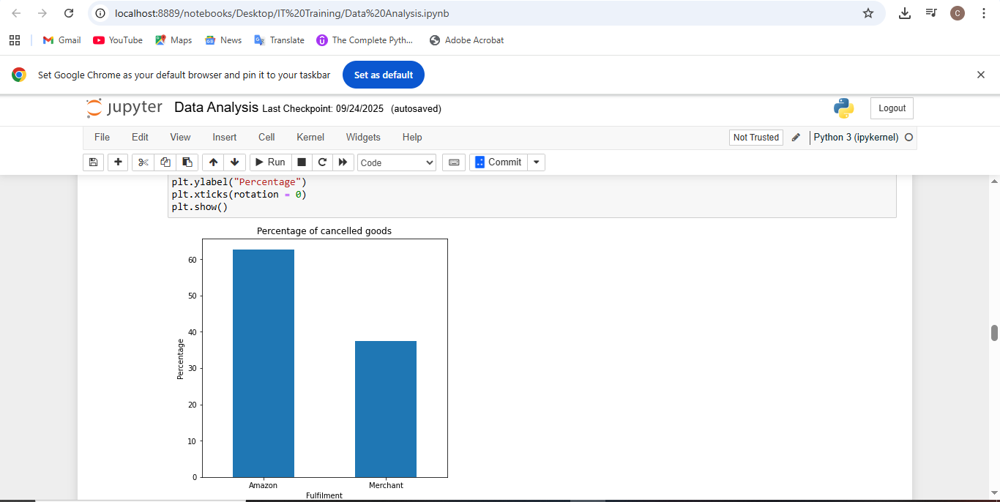

# Order Cancellation Trends and Insights from the Status Column in Amazon Sale Report Data

## Introduction
This project marks my very first step into the world of data analysis as I continue learning data science and machine learning. Using Python, I explored an Amazon Sales Report dataset with the aim of analyzing trends and extracting valuable insights.
The goal of this analysis is to answer key business questions and provide meaningful interpretations that can guide Amazon in making data-driven decisions. Through this project, I not only practiced essential data analysis techniques but also built a foundation for my journey into the broader field of data science.

**_Disclaimer_** : _This dataset was obtained from Kaggle and is used strictly for educational and learning purposes. I do not claim ownership or rights to the data. All credit goes to the original data owner or creator._

## Problem Statement
Despite a large volume of orders on Amazon, a significant number of items end up being cancelled. This raises important questions🤔:
1. What are the main reasons behind order cancellations?
2. Which factors contribute most to cancellations?
3. How can insights from the data help reduce cancellations and improve customer satisfaction?

## Skills and Concepts Demonstrated
The following Python skills and data analysis concepts were applied in this project:
1. Data cleaning and preprocessing using pandas (formatting columns, filtering data).
2. Exploratory Data Analysis (EDA) through pandas.
3. Data visualization with Matplotlib to identify trends and patterns.
4. Crosstab analysis to compare categorical variables and understand relationships within the sales data.
5. Percentage calculations to show proportions and highlight cancellation trends.
6. Problem-solving with Python by framing business questions and answering them with data.

## Data Sourcing
The dataset used for this project was obtained from Kaggle in the form of a CSV file. 
It contains sales records from Amazon.
The data served as the foundation for performing exploratory analysis and deriving insights into order trends and cancellation patterns.

---

## Data Transformation/Cleaning

---

The original dataset contained 128,975 rows and 24 columns.

---

After reviewing the dataset, I identified and selected 8 relevant columns that were most useful for this analysis. These columns were concatenated to form a new, more focused dataset.
No missing values were found in the selected columns, which made the cleaning process straightforward.

## Analysis and Visualization
You can view the full analysis and visualization [here](http://localhost:8888/notebooks/Desktop/IT%20Training/Data%20Analysis.ipynb) on jupyter notebook. 

---

A bar chart visualization to highlight the distribution of order outcomes. From the chart, it is evident that Amazon records a higher rate of cancelled goods compared to Merchant.
---

We also checked the percentage of cancellations between Amazon and Merchant, looking only at the cancelled items.
---

We concluded the report with a bar chart visualization showing the percentage distribution of Not B2B orders between Amazon and Merchants. This provided a clearer comparison of how each channel contributes to B2B transactions.

## Conclusions and Recommendations
This conclusion is based solely on the analysis of orders from Maharashtra State.

Recommendation: Further investigation is required to determine if the same factors contribute to high cancellation rates in other states with significant cancellations.

Thank you for following through.😊
